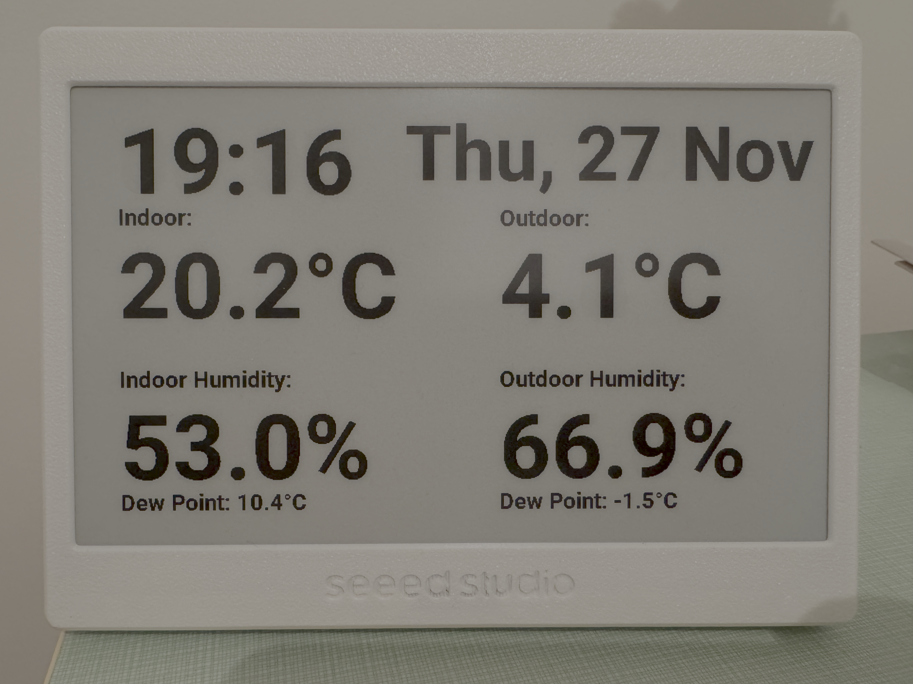

# ESP Home epaper display



## Compiling and running

### Prerequisites

#### Install esphome in a local python environment.
```
python3 -m venv ./venv
source ./venv/bin/activate
pip install esphome
```
#### Populate secrets.yaml

Create a secrets.yaml file and populate the values as shown in [secrets-example.yaml](secrets-example.yaml)

### Building and running:
```
esphome run ha-demo.yaml
```

